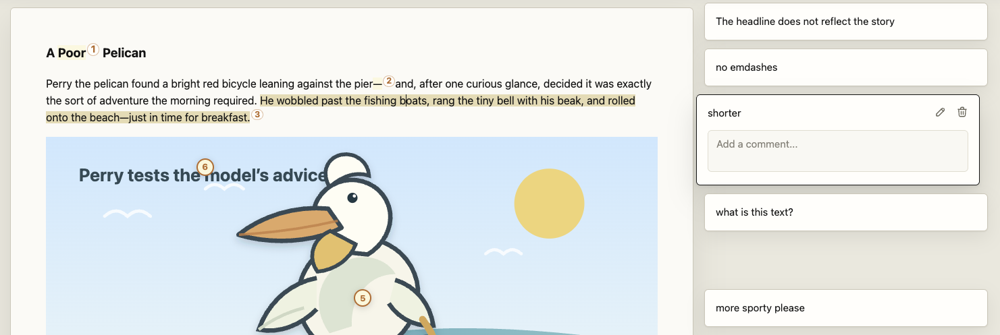
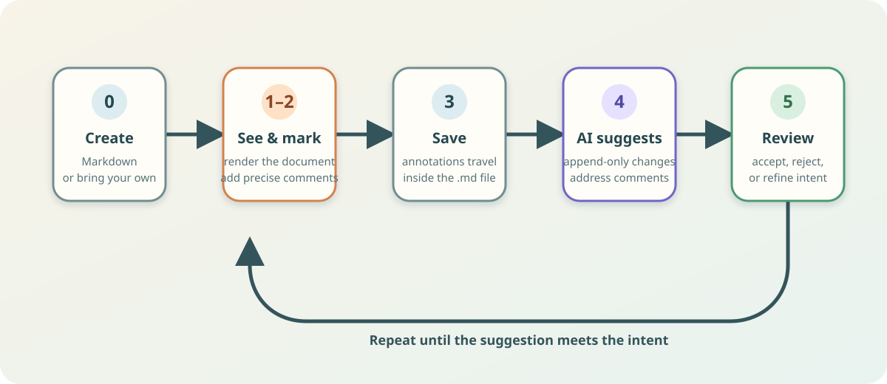

# Markleft Editor

**Suggestion mode for Markdown—built for human review and AI-assisted revision.**

Markleft keeps comments, discussions, and proposed changes *in the Markdown file itself*. Open a local document, leave precise feedback on text, blocks, code, images, SVGs, tables, and Mermaid diagrams, then review AI suggestions in context before accepting them.



## Why Markleft

AI drafts improve through iteration, but ordinary chat workflows lose the context that makes feedback useful: the exact phrase, block, visual detail, or intent behind a requested change. Markleft turns that feedback into durable, portable document data.

- **Point, don’t describe.** Anchor feedback to the exact content under review.
- **Keep intent beside the work.** Comments and replies travel with the `.md` file.
- **Review before applying.** AI changes arrive as individual suggestions, not an opaque rewrite.
- **Stay compatible.** Markleft annotations are standard Markdown footnotes with reserved identifiers; unaware renderers still show readable footnotes.
- **Work locally.** The editor runs in the browser against local Markdown files.



## The format

Markleft encodes review data in Markdown footnotes. A range comment, for example, is both readable Markdown and a precise instruction for a Markleft-aware editor or AI:

```markdown
This sentence needs less ceremony.[^range-prev-12-chars-14824-a1b2]

[^range-prev-12-chars-14824-a1b2]: Make this more direct.
```

It supports range, block, code, image-point, inline-SVG, reply, and suggestion annotations. Stable block identifiers make structural suggestions addressable, while hashes reveal when a target has become stale. The full format is in [MARKLEFT.md](MARKLEFT.md).


## Try it

Prerequisite: Node.js 22 or newer and pnpm 11.

```bash
pnpm install
pnpm exec playwright install chromium webkit
pnpm build
```

Open `example.md.html` in a browser after building. The document loads the generated `local-md.js` editor bundle and can be edited and saved locally.

For bookmarklet use, build the bundle and add the contents of `bookmarklet.txt` as a browser bookmark URL:

```bash
pnpm build
```

## Development

```bash
pnpm test
pnpm test:e2e
pnpm test:all
pnpm watch
```

The project is a TypeScript browser application built with esbuild. Unit tests use Vitest; Playwright exercises the generated editor in a real browser. `pnpm build:dev` produces a readable development bundle and source maps for browser debugging.

## Repository layout

- `src/` — editor UI, Markdown conversion, annotation handling, file access, and round-trip preservation.
- `test/` — focused unit tests and format fixtures.
- `e2e/` — browser-level editing, saving, rendering, and undo/redo tests.
- `example.md.html` and `examples/` — self-rendering Markdown documents to explore locally.
- `MARKLEFT.md` — the Markleft annotation-format specification.
- `docs/assets/` — visual examples and the annotated pelican sample from the original Markleft walkthrough.

## Status

This is an active prototype of the Markleft editor and format. The important behavior is covered by type checks, linting, unit tests, and end-to-end tests; the format remains intentionally open for iteration.

## License

No license has been selected yet. All rights reserved until one is added.
