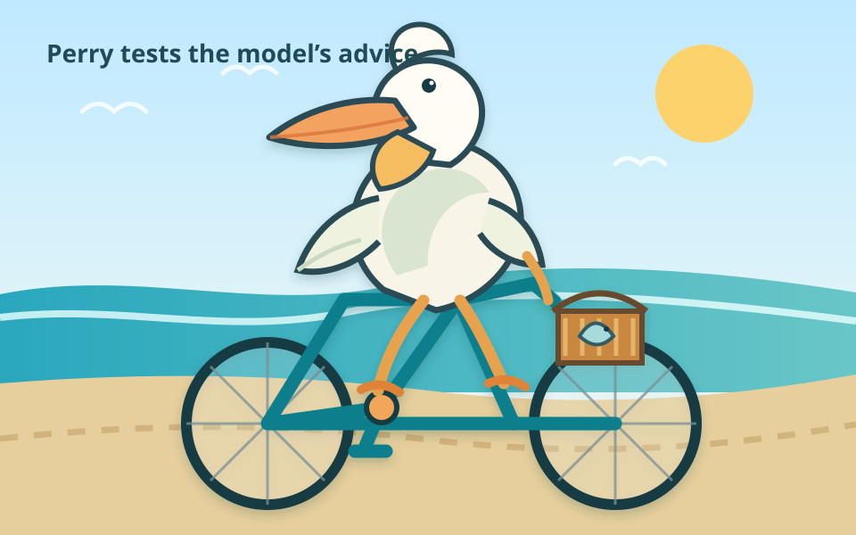
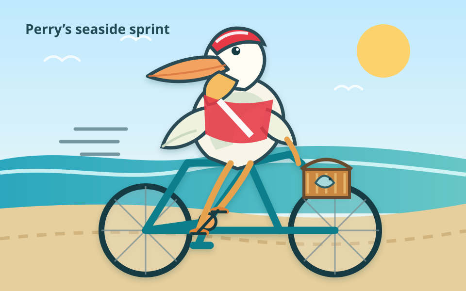

<!-- markleft:block id="b93e6692" -->
### A Poor[^range-prev-4-chars-97865-f6bd] Pelican

<!-- markleft:block id="bdb8d98e" -->
Perry the pelican found a bright
red bicycle leaning against the pier—[^range-prev-1-chars-10180-113e]and,
after one curious glance,
decided it was exactly the sort of adventure
the morning required.
He wobbled past the fishing boats,
rang the tiny bell with his beak,
and rolled onto the beach—just in time for breakfast.[^range-prev-101-chars-29497-aa1c]

<!-- markleft:block id="b50ef3ca" -->

[^image-5066-4166-46897-f262]
[^image-5773-7097-65647-f262]
[^image-4702-1923-71730-f262]

[^range-prev-4-chars-97865-f6bd]: promises the wrong story

[^range-prev-1-chars-10180-113e]: remove em-dashes in the document

[^range-prev-101-chars-29497-aa1c]: shorten this

[^image-5066-4166-46897-f262]: should look sportier

[^image-5773-7097-65647-f262]: put this feet on a pedal

[^image-4702-1923-71730-f262]: head looks wrong

[^suggestion-s1-update-block-b93e6692]: ### Perry’s Seaside Sprint

    [^range-prev-4-chars-97865-f6bd]

[^suggestion-s2-update-block-bdb8d98e]:
    Perry the pelican spotted a bright red bicycle by the pier. After one curious glance, he climbed aboard, wobbled past the fishing boats, rang the bell with his beak, and reached the beach just in time for breakfast.

    [^range-prev-1-chars-10180-113e] [^range-prev-101-chars-29497-aa1c]

[^suggestion-s3-update-block-b50ef3ca]:
    

    [^image-5066-4166-46897-f262] [^image-5773-7097-65647-f262] [^image-4702-1923-71730-f262]
