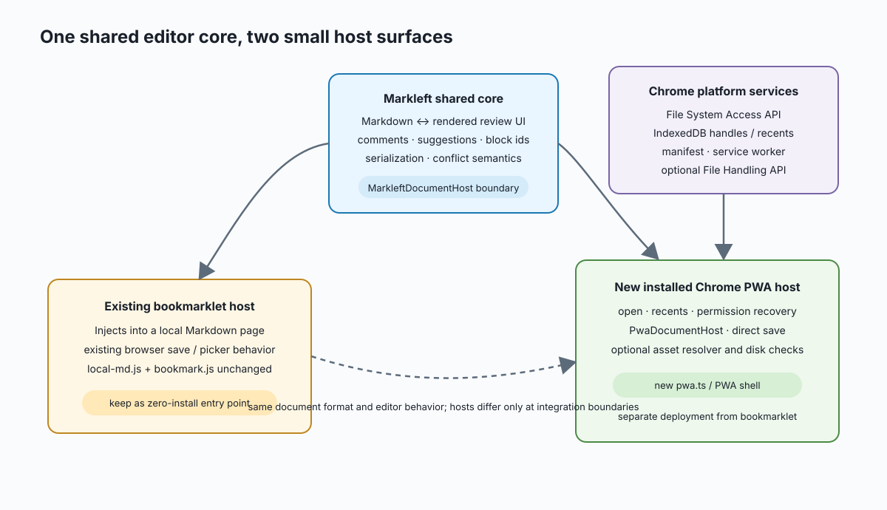
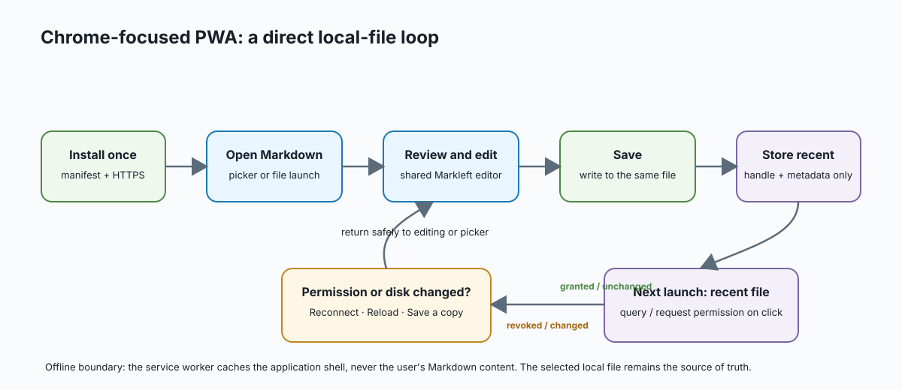

<!-- markleft:block id="b5aaa100" -->
# Markleft as a Chrome PWA — implementation spike

<!-- markleft:block id="bb5a8f12" -->
## Decision in one sentence

<!-- markleft:block id="b88da6ea" -->
Add a separately hosted, installable Markleft application that opens and saves local Markdown through Chrome's File System Access APIs, while preserving the bookmarklet as the zero-install way to enhance a Markdown file already open in Chrome.

<!-- markleft:block id="b2cacbcf" -->
This is a product and technical spike, not a commitment to ship every browser or operating system. The first release should target current desktop Chrome on macOS, with a deliberately useful fallback when an optional PWA feature is not available.

<!-- markleft:block id="b94389c8" -->


<!-- markleft:block id="b8fcdcd1" -->
## What the PWA experience should feel like

<!-- markleft:block id="bdbd690b" -->
1. A person installs **Markleft** from Chrome once.
2. They choose **Open Markdown** (or later, choose Markleft from Finder's *Open with* menu).
3. Markleft opens the document in its own focused window, with the same review, comment, suggestion, and direct-save experience as today.
4. **Save** writes back to that exact local file after Chrome has granted permission. There is no download-copy detour.
5. The next launch offers recent documents. If Chrome has retained access, reopening is one click; otherwise Markleft asks for permission again.
6. Once installed, the application shell works without a network connection. The Markdown document remains local; it is never silently uploaded or copied into the cache.

<!-- markleft:block id="bd19be0d" -->


<!-- markleft:block id="b2b9f4ce" -->
## The boundary: what a PWA can and cannot replace

<!-- markleft:block id="b710d771" -->
An installed PWA is a web application served over HTTPS. It cannot inject itself into a `file://` Markdown page already displayed by Chrome. That remains the bookmarklet's job.

<!-- markleft:block id="bdf78bff" -->
The PWA instead becomes a second, native-feeling entry point for the same editor:

<!-- markleft:block id="bc773aa4" -->
| Need | Bookmarklet, retained | Installed PWA, new |
| --- | --- | --- |
| Start from a Markdown file already open in Chrome | Yes | No |
| Install once and launch a focused app window | No | Yes |
| Pick a local Markdown file and write it back directly | Existing browser flow | Yes, primary flow |
| Reopen recent documents | Limited to current page/browser state | Yes, via stored file handles |
| Open `.md` from Finder / Explorer | No | Chrome file handling API, where registered and supported |
| Work after the app has been installed but offline | Depends on loaded page | Yes, for the application shell and previously granted local files |
| Preserve comments, suggestions, block ids, and Markdown format | Yes | Yes: shared editor core |

<!-- markleft:block id="bc306f66" -->
The key scope rule is: **do not turn the bookmarklet into a PWA and do not make the PWA emulate the bookmarklet.** Build two small host adapters around the same Markleft core.

<!-- markleft:block id="b70355cf" -->
## What we can reuse immediately

<!-- markleft:block id="bdf3e097" -->
The phase-0–2 refactor already created the right seam:

<!-- markleft:block id="be7b775a" -->
- `src/core/`, parsing, serialization, review state, comment anchors, and UI are host-neutral.
- `src/host/document-host.ts` defines the portable `MarkleftDocumentHost` contract: read a Markdown snapshot, write it with an optional revision, optionally watch changes, and optionally resolve local assets.
- `src/embedded.ts` mounts the same editor inside another product; Superset uses this route.
- `src/file/handle-store.ts` already demonstrates IndexedDB storage for browser file and directory handles.
- The existing browser save, folder, and conflict logic provide a behavioral reference. They should be extracted behind the PWA host instead of copied.
- The `local-md.js` bundle, `pages/bookmark.js`, and bookmarklet build stay untouched as a supported distribution route.

<!-- markleft:block id="b96420bb" -->
This means the PWA does **not** need a second Markdown renderer, an alternate file format, or a separate comments system.

<!-- markleft:block id="b01cf8a9" -->
## Concepts to add

<!-- markleft:block id="b86f8a6c" -->
### 1\. A PWA application shell

<!-- markleft:block id="b55e990f" -->
Create a new browser entry point, separate from `src/local-md.ts`, that renders a minimal start screen and mounts Markleft once it has a document host. It owns:

<!-- markleft:block id="b2ed9f99" -->
- **Open Markdown** and **Open folder** actions;
- the recent-document list and permission/reconnect state;
- an explicit **New document** flow;
- app-level errors such as file moved, access revoked, or a newer disk version;
- the service-worker registration and update prompt.

<!-- markleft:block id="b79ad841" -->
The shell should not contain editor state or Markdown conversion rules. After a file is selected it calls the current `mountApp` / `mountMarkleft` surface with a `PwaDocumentHost`.

<!-- markleft:block id="be5180ef" -->
### 2\. `PwaDocumentHost`

<!-- markleft:block id="b8c7242f" -->
Implement a browser-PWA adapter for `MarkleftDocumentHost` backed by a `FileSystemFileHandle`:

<!-- markleft:block id="b130bddd" -->
- `read()` calls `getFile()` and returns text plus a revision derived from `lastModified`, size, and preferably a content hash.
- `write()` checks `expectedRevision`, then uses `createWritable()` / `write()` / `close()` to replace the selected file as Chrome provides.
- `resolveAsset(relativePath)` should resolve image references from an opened directory handle and return a safe object URL. Object URLs need lifecycle cleanup when an image or document is closed.
- `watch()` is optional. The File System Access API has no general native file watcher, so the first version should poll only while the app is visible and clean, then show a clear reload-or-keep-editing conflict choice.

<!-- markleft:block id="bc75163f" -->
Use a file handle for a single document and an optional directory handle for asset resolution and workspace navigation. Do not request a directory merely to open one file: least privilege makes the permission story more natural.

<!-- markleft:block id="bab6f178" -->
### 3\. Recent documents and permissions

<!-- markleft:block id="b861cb41" -->
Store serializable file/directory handles in IndexedDB together with display metadata (name, last known revision, last opened time). On startup:

<!-- markleft:block id="b6aaf28e" -->
1. list recents without reading their contents;
2. when the person selects one, call `queryPermission({ mode: "readwrite" })`;
3. only request permission in response to that click;
4. gracefully return to the picker if access was revoked or the file moved.

<!-- markleft:block id="bcad5aaa" -->
Installed Chrome apps can retain granted file permissions, but Markleft must always treat permission as revocable and never promise that reopening will be prompt-free. Chrome documents serializable handles, IndexedDB storage, and the permission-check pattern in its [File System Access guide](https://developer.chrome.com/docs/capabilities/web-apis/file-system-access).

<!-- markleft:block id="bfbf06c2" -->
### 4\. Installability and offline application code

<!-- markleft:block id="b7db2557" -->
Ship a web app manifest, icon set, HTTPS deployment, and a service worker.

<!-- markleft:block id="b371c9d9" -->
The worker should precache only versioned application assets: HTML, JavaScript, CSS, fonts, icons, and renderer dependencies. It must not cache arbitrary local Markdown documents, file handles, or their content. Those remain accessible through Chrome's permissioned local-file APIs, not through the Cache API.

<!-- markleft:block id="b4e741d7" -->
Use a conservative update policy: download a new application version in the background, then let the person reload after saving. Avoid replacing a running editor while it has unsaved changes.

<!-- markleft:block id="b61711d6" -->
### 5\. File handling, as a progressive enhancement

<!-- markleft:block id="bccf223b" -->
After the picker-based PWA works, add a manifest `file_handlers` declaration for `.md`, `.markdown`, and optionally `.mdx`, with a `launchQueue` consumer. That lets an installed app appear as an operating-system option for opening matching files. Chrome prompts before the app can see a file opened this way; this is a separate, user-controlled permission.

<!-- markleft:block id="b2085868" -->
This must remain an enhancement, not the only entry route: operating-system registration and availability vary by platform and Chrome configuration. The [Chrome File Handling guide](https://developer.chrome.com/docs/capabilities/web-apis/file-handling) and the newer [file-explorer launch pattern](https://web.dev/patterns/files/handle-files-opened-from-the-file-explorer/) cover the manifest and `launchQueue` model.

<!-- markleft:block id="bb671e96" -->
### 6\. User-visible document lifecycle

<!-- markleft:block id="bd3c01f2" -->
The PWA needs a small document status model that the bookmarklet does not:

<!-- markleft:block id="b7655d07" -->
``` text
no document → opening → ready/clean ⇄ ready/dirty → saving → ready/clean
                         │                  │
                         └─ permission lost ┴─ disk changed → needs attention
```

<!-- markleft:block id="b8dd2c62" -->
Status should appear in the application chrome, not as an intrusive modal. Every error state needs a next action: **Reconnect**, **Reload**, **Save a copy**, or **Keep editing**. A write conflict must never silently overwrite a newer on-disk document.

<!-- markleft:block id="bafaae70" -->
## Proposed shape in this repository

<!-- markleft:block id="b8eed509" -->
``` text
src/
  core/                         existing, shared document logic
  editor/                       existing, shared editing and review UI
  host/
    document-host.ts            existing portable contract
    browser/                    existing bookmarklet-oriented behavior
    pwa/
      document-host.ts          new FileSystemFileHandle adapter
      recent-documents.ts       new IndexedDB metadata + handle repository
      permissions.ts            new permission checks and reconnect helper
      asset-resolver.ts         new directory-handle/object-URL adapter
  pwa.ts                        new installable app entry point
  pwa-shell.ts                  new start/recent/error application chrome
  pwa-service-worker.ts         new offline app-shell policy
public/
  manifest.webmanifest          new PWA manifest
  icons/                        new maskable and standard app icons
build-pwa.mjs                   new PWA build alongside build.mjs
```

<!-- markleft:block id="beaf0102" -->
`build.mjs` remains responsible for the bookmarklet output. `build-pwa.mjs` can share esbuild settings in a small common build module, but should produce a separate, deployable `dist/pwa/` directory. Keeping outputs separate prevents a PWA deployment change from breaking the hosted bookmarklet loader.

<!-- markleft:block id="b53479ac" -->
## Implementation sequence

<!-- markleft:block id="b0f9de7c" -->
### Phase A — prove the application shell (small vertical slice)

<!-- markleft:block id="b9d87100" -->
- Add `pwa.ts`, a manifest, basic icons, HTTPS static hosting configuration, and an app-shell service worker.
- Add **Open Markdown** using `showOpenFilePicker()` and direct **Save** using a file-backed `PwaDocumentHost`.
- Mount the existing editor with that host and retain comments, block ids, and direct write behavior.
- Add a Playwright smoke test for open/edit/save through a test double, plus a manual Chrome install/offline checklist.

<!-- markleft:block id="bc8d13b2" -->
**Exit criterion:** a person can install the app, select an `.md`, add a Markleft comment, save it over the same file, close, relaunch, and reopen it from Recents or the picker. The bookmarklet build behaves exactly as before.

<!-- markleft:block id="bcc9b949" -->
### Phase B — make reopening and local assets trustworthy

<!-- markleft:block id="b640c470" -->
- Store recents and handles in IndexedDB, including permission recovery.
- Add optional directory selection and image/SVG asset resolution.
- Introduce revision checks and visible disk-change handling.
- Test revoked permission, moved file, a changed file on disk, and paths with spaces and non-ASCII characters.

<!-- markleft:block id="bb73a6de" -->
**Exit criterion:** repeated daily use is pleasant without making durability or permissions invisible.

<!-- markleft:block id="beaf4394" -->
### Phase C — operating-system launch and polish

<!-- markleft:block id="b7cf2a44" -->
- Add `file_handlers` and `launchQueue` handling behind feature detection.
- Verify Finder's **Open with Markleft** behavior on supported Chrome/macOS combinations.
- Add unsaved-work navigation protection, accessible keyboard flows, update prompts, and a compact recent-documents management view.

<!-- markleft:block id="be730e67" -->
**Exit criterion:** file association feels native where Chrome supports it, while picker launch remains complete and predictable everywhere in the target.

<!-- markleft:block id="be10cf7c" -->
#### Phase C delivery note

<!-- markleft:block id="bf7517e1" -->
The PWA now declares `.md`, `.markdown`, and `.mdx` file handlers and consumes
Chrome's `launchQueue`. After the deployed PWA is installed, Chrome can register
Markleft as an **Open with** option in Finder. Double-clicking a document opens
Markleft only after the person selects it as the default application in Finder;
a web app cannot, and should not, take over that default silently.

<!-- markleft:block id="bffd5270" -->
File-handler launches provide the file itself, not its parent directory. A
launched document therefore opens and saves directly, but needs **Open folder**
if it also has relative image/SVG assets. The normal picker and folder flows
remain available as fallbacks.

<!-- markleft:block id="be2f8d2d" -->
The service worker cache is build-versioned: an installed app updates its shell
and file-launch consumer together. This prevents a previous cached start screen
from handling a newly registered Finder file launch.

The PWA also accepts a Markdown file dropped onto its window. Chrome supplies a
`FileSystemFileHandle`, so this route retains direct save. A drop into an empty
Markleft window opens there; a drop while a document is already open creates a
new desktop PWA window and transfers the handle only through a same-origin,
one-time message. This keeps the already-open review undisturbed.

<!-- markleft:block id="b7ee02f1" -->
### Phase D — release hardening

<!-- markleft:block id="ba06cc41" -->
- Define versioning and cache invalidation; audit third-party assets and CSP.
- Test Chrome stable on the supported desktop versions, online and offline.
- Add privacy copy explaining precisely that Markdown stays local unless the person invokes an external agent/integration.
- Publish the PWA independently of bookmarklet releases, while running the shared test suite for both artefacts on every release.

<!-- markleft:block id="b59faef6" -->
## Deliberately out of scope for the first PWA

<!-- markleft:block id="bba00587" -->
- Cloud sync, user accounts, or a server-side document store.
- Background writing, automatic overwrite of disk changes, or silent external synchronization.
- Safari/Firefox parity. The PWA must fail gracefully there, but Chrome is the first supported runtime because its File System Access and File Handling APIs make genuine local-file save possible.
- Replacing the bookmarklet. Both forms are valuable: PWA for a focused editor, bookmarklet for an already-open local Markdown view.
- Agent invocation. The existing `addressAnnotations` host seam can later be supplied by a runtime integration without making PWA file access dependent on any AI service.

<!-- markleft:block id="b0bae648" -->
## Main risks and decisions to validate in Phase A

<!-- markleft:block id="b8d7f143" -->
| Question | Recommended answer for the spike |
| --- | --- |
| Where is the PWA hosted? | The existing GitHub Pages origin is a natural first choice if it can serve the manifest, service worker, icons, and immutable versioned assets over HTTPS. |
| How do we handle a disk change while editing? | Compare revision before write; if changed, show an explicit conflict flow. Start with manual reload rather than background polling. |
| Are stored handles a source of private document copies? | No. IndexedDB stores permissioned handles and minimal recent metadata, not Markdown contents. |
| Can we promise Finder file association? | No. Treat it as Phase C enhancement and test it on the actual supported Chrome/macOS combination. |
| Do we need a framework or PWA toolkit? | No for Phase A. The app is small enough for an explicit manifest and service worker; add a tool only if cache-versioning complexity proves it worthwhile. |
| Does this affect bookmarks? | No. The bookmarklet bundle and loader remain an independent build and release path. |

<!-- markleft:block id="b36fdab6" -->
## Review checklist

<!-- markleft:block id="b558305a" -->
- Does the two-surface model make sense: bookmarklet for an open browser file, PWA for opening and saving a local document as an app?
- Is local-only storage the right default, including no Markdown-content cache?
- Is Chrome/macOS the right first supported combination?
- Should Phase A include a folder picker for image-relative documents, or keep it strictly single-file and defer assets to Phase B?
- Is the proposed first PWA host URL acceptable, or should it have a dedicated `app.` origin before any implementation begins?

<!-- markleft:block id="b10a63bb" -->
## Local development

<!-- markleft:block id="b29d436b" -->
The PWA build and local static server use only Node and pnpm:

<!-- markleft:block id="b4c858cf" -->
``` sh
pnpm dev:pwa
```

<!-- markleft:block id="b14e0653" -->
This builds `dist/pwa/` and serves it at `http://localhost:4173`. `localhost`
is a secure context in Chrome, so service-worker and File System Access testing
work without a local TLS certificate. To serve a build that already exists, run
`pnpm serve:pwa` instead.

<!-- markleft:block id="b8ab02c8" -->
## Reference material

<!-- markleft:block id="be304139" -->
- [Chrome: File System Access API](https://developer.chrome.com/docs/capabilities/web-apis/file-system-access) — local file handles, direct writes, permissions, and IndexedDB handle persistence.
- [Chrome: persistent File System Access permissions](https://developer.chrome.com/blog/persistent-permissions-for-the-file-system-access-api) — installed-app permission behavior and its limits.
- [Chrome: File Handling API](https://developer.chrome.com/docs/capabilities/web-apis/file-handling) — installed PWA file registration and user consent.
- [web.dev: open files from a file explorer](https://web.dev/patterns/files/handle-files-opened-from-the-file-explorer/) — `file_handlers` manifest entries and `launchQueue` consumption.
