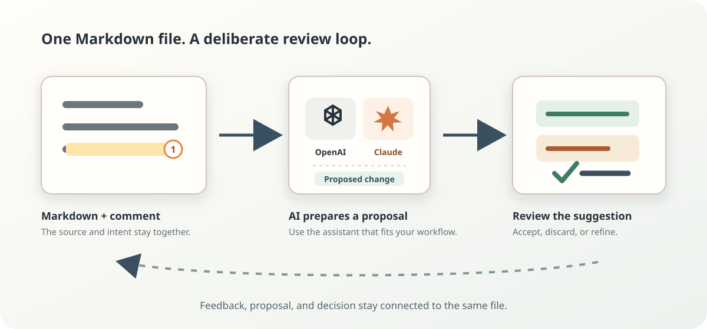
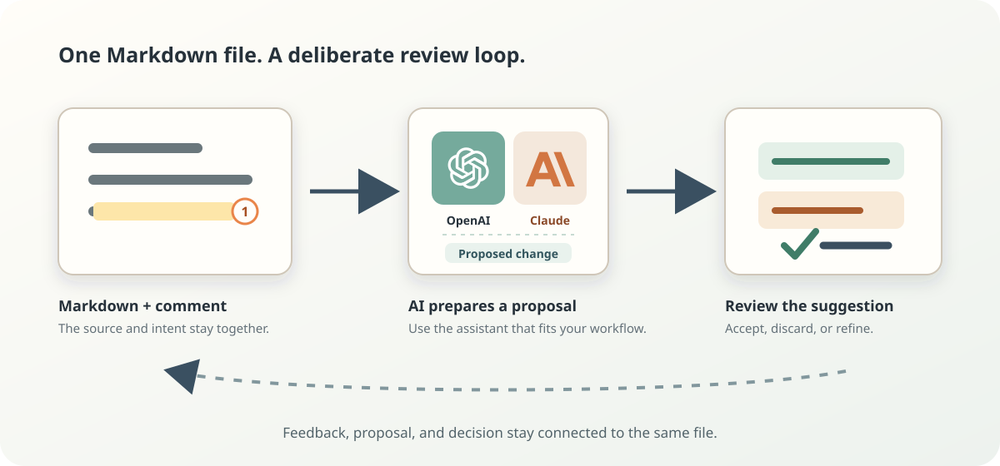

<!-- markleft:block id="b9f4455b" -->
# Review – don't chat

<!-- markleft:block id="b246bcd0" -->
**Markleft gives your and ai's remarks and suggestions on Markdown a place to live: in the document itself.**

<!-- markleft:block id="b246bcd0" -->
**Intall Now&#xA0;**

<!-- markleft:block id="b246bcd0" -->
**Video**

<!-- markleft:block id="b246bcd0" -->
## Finally read those AI Plans

<!-- markleft:block id="bc9095f5" -->
AI rarely gets your intent right on the first prompt. Reading through a wall of text without a place to take notes sucks. You made it through? Great - now you type in your feedback "Make the third Sentence in the second Paragraph less technical". Than it comes back with a new File again - you read it again and check if your prompt was good... That sucks - We can do better!

<!-- markleft:block id="b246bcd0" -->
**Markleft gives Markdown comments and suggestions a place to live: in the document itself.** Point to the exact text, block, image, table cell, or diagram; explain what matters; then review a proposed change before it becomes part of the file.

<!-- markleft:block id="b1068d80" -->
Your Markdown remains the source of truth. Your feedback remains attached to the work.

<!-- markleft:block id="bb3b9447" -->
[^image-4949-3754-67993-d717]

<!-- markleft:block id="bafeed55" -->
## Feedback that keeps its context

<!-- markleft:block id="b27c001b" -->
Markleft brings back the familiar review loop:

<!-- markleft:block id="b5c67e4c" -->
1. **Point, don’t describe.** Select the exact words or place a marker on an image, SVG, code block, table, or Mermaid diagram.
2. **Keep the reason beside the work.** Comments and replies are stored as portable Markdown footnotes, so the intent travels with the file.
3. **Review the proposal.** Suggestions appear in context. Accept, discard, or refine each one instead of comparing an opaque rewrite.

<!-- markleft:block id="b85169f2" -->
> “Make this less formal” is useful only when it stays next to the sentence it refers to.

<!-- markleft:block id="b73ecfd4" -->
## Built for humans and AI to iterate together

<!-- markleft:block id="b19d5c02" -->
Markleft is a review surface, not another document format or a walled garden.

<!-- markleft:block id="ba30e0b2" -->
- **Local by default.** Open a file from your computer and save it back to the same place. Markleft asks before it receives file access.
- **Plain Markdown underneath.** Comments use normal footnotes; unaware renderers still show readable notes.
- **Suggestions, not takeovers.** Proposed edits are explicit and reviewable before they alter the document.
- **Works with real documents.** Review prose, lists, tables, code, images, inline SVG, and Mermaid diagrams in one file.
- **Bring your own assistant.** After saving, use the generated instructions with the AI tool you prefer.

<!-- markleft:block id="bfd6a796" -->
## Start with the Markdown you already have

<!-- markleft:block id="b89d89c4" -->
Open a local `.md`, `.markdown`, or `.mdx` file with **Open Markdown…** in the Markleft menu, or press `⌘O` on macOS (`Ctrl+O` on Windows and Linux). You can also drag a Markdown file onto Markleft.

<!-- markleft:block id="b4abc016" -->
Once the page is installed as an app, Markdown files can open directly from Finder

<!-- markleft:block id="b4abc016" -->
**Intall Now**

<!-- markleft:block id="b7829f91" -->


<!-- markleft:block id="b10bab67" -->
The installed app is optional. The website is already the editor: open a document when you are ready.

<!-- markleft:block id="b82efdc6" -->
## A small format with durable review data

<!-- markleft:block id="bb7c306b" -->
Markleft records annotations using Markdown’s established footnote mechanism. A comment has an anchor and a definition; suggestion metadata is appended rather than silently rewriting the original document. Stable block IDs make structural changes addressable when you want them.

<!-- markleft:block id="bbbb5492" -->
```markdown
This sentence needs a more direct ending.[^range-prev-16-chars-7f3a-a91c]

[^range-prev-16-chars-7f3a-a91c]: Say what the reader can do next.
```

<!-- markleft:block id="b0610335" -->
That means a file remains understandable in GitHub, a text editor, or a normal Markdown renderer — and becomes a rich review workspace in Markleft.

<!-- markleft:block id="b2c2d7fc" -->
## Try a real review loop

<!-- markleft:block id="b611cee9" -->
Open any Markdown file, leave one precise comment, save, and ask your assistant to address the annotations in the saved document. Markleft lets you inspect each resulting suggestion in context before accepting it.

<!-- markleft:block id="b09490ea" -->
For the longer story behind the workflow, read [How I review Claude plans in Markdown](https://blog.lysk.tech/markleft-ai-markdown-review). The source and current prototype are available on [GitHub](https://github.com/martin-lysk/markleft).

<!-- markleft:block id="b72b082e" -->
---

<!-- markleft:block id="bf39fdd7" -->
**Ready when your document is.** Use the Markleft menu to open Markdown, or drag a file onto this page.

[^image-4949-3754-67993-d717]: Can we use the real logos here?

[^suggestion-s4-update-block-bb3b9447]: 
